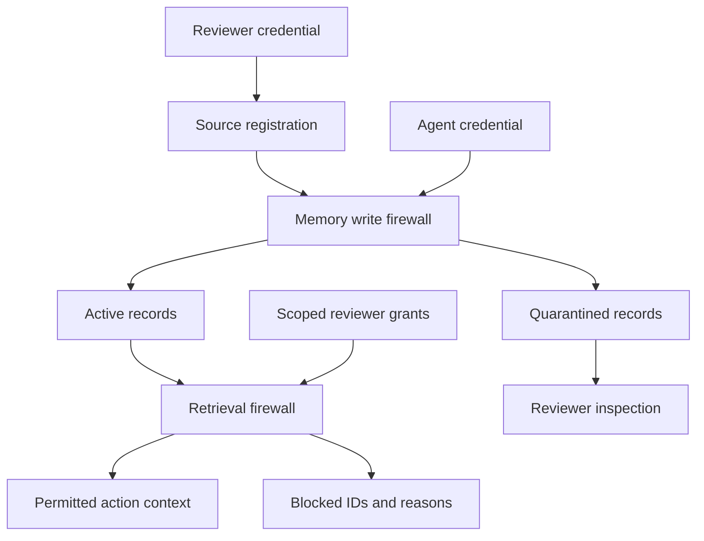

# Milestone 1: origin-bound memory controls

## Data flow

The API never performs a payment. All examples are local simulations. A future tool adapter must enforce the action gate separately from model-generated text.

## Invariants

1. Only reviewers register source identities. Identities cannot be overwritten.
2. Agents may ingest external roots only. User, system, and tool roots require a reviewer until authenticated adapters exist.
3. A root references exactly one source. A derivation references existing parents, never a replacement source.
4. Derived authority is the minimum parent authority. Derived origins and taints are unions of their parents' metadata.
5. Authority, origin, lifecycle, and taint are server-owned fields. Request models reject attempts to set them.
6. All ancestors must remain active at retrieval and approval time. A later conflict or revocation invalidates prior eligibility.
7. Every consequential retrieval requires an unexpired exact-memory, content-hash, action, and target grant. Authority alone cannot authorize it.
8. Grants never propagate across summaries. Quarantine and revocation override grants.
9. The allowed result limit is applied after policy filtering; blocked candidates cannot crowd all useful context out of a small top-k window.
10. Record changes and audit events commit together. A failed operation rolls back.

## Core types

| Object | Role |
|---|---|
| Source | Reviewer-registered origin type and locator |
| Memory | Immutable content and lineage; mutable restrictive lifecycle metadata |
| Claim | Caller-supplied entity, attribute, value for exact conflict checks |
| Grant | Reviewer permission for a particular memory to influence an action and target |
| AuditEvent | Actor, event type, subject IDs, reason, UTC timestamp |

Origin ceilings: external web/email/file = 1; tool = 2; user information = 3; system = 5. These numbers do not estimate truthfulness. Explicit authorization is represented by a grant, not by changing a memory's score to 4.

## Threat model

In scope: external content attempting to gain action authority through persistence and declared derivations; API callers spoofing server-owned fields; agents accessing reviewer operations; inherited quarantine; stale grants after revocation; conflicting structured claims; loss of atomicity.

Out of scope in this milestone: compromised reviewer credentials or database, malicious code in the trusted adapter, omitted/false lineage, a caller lying about its action, model instructions carried inside otherwise permitted informational data, exfiltration via a bypassing tool, cross-tenant isolation, resource exhaustion, and factual validation of arbitrary prose. These are integration requirements, not problems a regex or numeric trust score solves.

## Storage

`InMemoryStore` uses a lock and copy-on-write transactions. It loses all state on restart and is for examples and tests.

`Neo4jStore` uses managed transactions. A workspace node's revision update obtains a lock before reading its state. A transaction loads typed records, executes policy, and persists changed records. Memory and source nodes are linked with `DERIVED_INTO` and `ORIGINATED` relationships. The graph and JSON record lineage are written in the same transaction.

All operations currently serialize per workspace and load all workspace records, including audit events. This is intentionally limited to small datasets. Before benchmark-scale ingestion, separate audit queries and move retrieval and graph traversals into indexed database queries. Any future optimization must preserve the security invariants and concurrency tests.

## Acceptance scenarios

- A declarative external account claim is informationally available but blocked for payment.
- An instruction is paraphrased twice; origin, taint, and quarantine survive.
- Mixed system and website parents yield website-level authority.
- Agent credentials cannot register a system source or ingest a user-root memory.
- A grant for one supplier cannot authorize another supplier or another action.
- A grant on a parent does not apply to its summary.
- A new conflict blocks already existing descendants and prior approvals.
- Revoking a root disables all descendants and preserves unrelated records.
- An exception during a persistence transaction leaves no partial state.

## Roadmap

1. **This milestone:** deterministic core, credential boundary, persistent records, tests, runnable poisoning example.
2. **Agent integration:** LangGraph source adapters with mandatory lineage, provider interface, tool-time eligibility rechecks, simulated procurement actions.
3. **Retrieval and review:** embeddings, indexed Neo4j retrieval, human review UI, explicit conflict resolution, no silent promotions.
4. **Repair and evaluation:** independently supported claim reconstruction, benchmark adapter, naive and LLM-filter baselines, utility/security metrics with confidence intervals.

Do not call test fixture outcomes an attack-success benchmark. A passing deterministic test proves only the specified invariant for those inputs.
