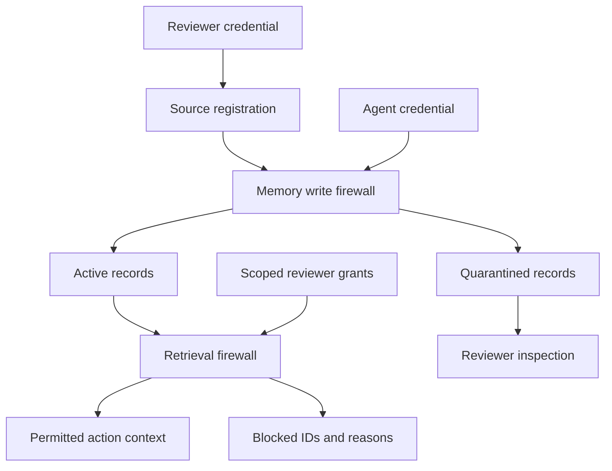

# Security architecture: memory core and procurement integration

## Data flow

The API never performs a real payment. The procurement integration records simulated payments through a separate execution gate. It does not treat model-generated text or a memory grant as transaction approval. See [procurement integration](procurement.md).

## Invariants

1. Only reviewers register source identities. Identities cannot be overwritten.
2. Agents may ingest external roots only. User, system, and tool roots require a reviewer until authenticated adapters exist.
3. A root references exactly one source. A derivation references existing parents, never a replacement source.
4. Derived authority is the minimum parent authority. Derived origins and taints are unions of their parents' metadata.
5. Authority, origin, lifecycle, and taint are server-owned fields. Request models reject attempts to set them.
6. All ancestors must remain active at retrieval and action-approval time. A later conflict or revocation invalidates prior eligibility.
7. Every consequential retrieval requires an unexpired exact-memory, content-hash, action, and target grant. If the memory carries a structured claim, that grant must bind to a live independent verification. Authority alone cannot authorize it.
8. Action grants never propagate across summaries. Quarantine and revocation override action grants.
9. The allowed result limit is applied after policy filtering; blocked candidates cannot crowd all useful context out of a small top-k window.
10. Semantic vectors are bound to content hashes and exact model identities. Similarity never grants permission; stale, missing, or incompatible vectors are excluded.
11. Record changes and audit events commit together. A failed operation rolls back.
12. Current content screening applies to text, structured claim fields, and ancestors at retrieval, grant, and tool-gate time, including records accepted by earlier versions.
13. The observation adapter checks current restrictions before calling a summarizer; restricted input produces a blocked run without a summary. Derived output passes the write firewall again.
14. A reviewer may create a bounded, expiring exception for informational retrieval of one direct-source record with only instruction-related restrictions. It never changes the stored record or permits derived records, action grants, or tool use. Revocation, conflicts, credentials, withdrawal, expiry, or a changed record/policy invalidate it. Delayed approval requests cannot recreate a withdrawn exception.

## Core types

| Object | Role |
|---|---|
| Source | Reviewer-registered origin type and locator |
| Memory | Immutable content and lineage; mutable restrictive lifecycle metadata |
| Claim | Caller-supplied entity, attribute, value for exact conflict checks |
| ClaimVerification | Reviewer attestation of a separately sourced claim check, with exact record binding, reference, method, expiry, and withdrawal |
| ContextReview | Exact record/policy-bound informational exception, with expiry and withdrawal history |
| Grant | Reviewer permission for a particular memory to influence an action and target |
| EmbeddingRecord | Server-owned normalized vector bound to a memory content hash and model identity |
| AuditEvent | Actor, event type, subject IDs, reason, UTC timestamp |

Origin ceilings: external web/email/file = 1; tool = 2; user information = 3; system = 5. These numbers do not estimate truthfulness. Explicit authorization is represented by a grant, not by changing a memory's score to 4.

## Threat model

In scope: external content attempting to gain action authority through persistence and declared derivations; API callers spoofing server-owned fields; agents accessing reviewer operations; inherited quarantine; stale grants after revocation; conflicting structured claims; loss of atomicity.

Out of scope: compromised reviewer credentials or database, malicious code in the trusted adapter, omitted/false lineage in generic memory API calls, a generic caller lying about its action, undetected model instructions carried inside otherwise permitted informational data, exfiltration via an unintegrated tool, cross-tenant isolation, resource exhaustion, and automatic factual validation of arbitrary prose or proof that declared evidence sources are independent. The bundled simulator addresses its own action boundary by hard-coding the payment action and deriving arguments from persisted records; it does not protect arbitrary external tools.

## Storage

`InMemoryStore` uses a lock and copy-on-write transactions. It loses all state on restart and is for examples and tests.

`Neo4jStore` uses managed transactions. A workspace node's revision update obtains a lock before reading its state. A transaction loads typed records, executes policy, and persists changed records. Memory and source nodes are linked with `DERIVED_INTO` and `ORIGINATED` relationships. The graph and JSON record lineage are written in the same transaction.

All operations currently serialize per workspace and load all workspace records, including audit events. This is intentionally limited to small datasets. Before benchmark-scale ingestion, separate audit queries and move retrieval and graph traversals into indexed database queries. Any future optimization must preserve the security invariants and concurrency tests.

## Acceptance scenarios

- A declarative external account claim is informationally available but blocked for payment.
- An instruction is paraphrased twice; origin, taint, and quarantine survive.
- Mixed system and website parents yield website-level authority.
- Agent credentials cannot register a system source or ingest a user-root memory.
- A grant for one supplier cannot authorize another supplier or another action.
- A grant on a parent does not apply to its summary.
- A new conflict blocks already existing descendants and prior approvals.
- Revoking a root disables all descendants and preserves unrelated records.
- An exception during a persistence transaction leaves no partial state.

## Roadmap

1. **Implemented:** deterministic core, credential boundary, persistent records, tests, runnable poisoning example.
2. **Implemented:** LangGraph observation adapter with mandatory summary lineage, optional chat-model summarizer, tool-time eligibility rechecks, exact transaction review, and simulated procurement actions. Hosted-model evaluation and real network adapters remain future work.
3. **Partly implemented:** local embeddings, exact cosine retrieval, and reviewer-only backfill. See [semantic retrieval](semantic-retrieval.md). A [reviewer dashboard](dashboard.md) now supports lineage inspection, scoped grants, revocation, payment review, retrieval checks, and audit history. A reviewer can now retire a structured conflict and its descendants and create an independently sourced replacement; see [conflict resolution](conflict-resolution.md). Indexed Neo4j retrieval and selective repair of existing descendants remain future work; no silent promotions.
4. **Partly implemented:** an [offline evaluation runner](evaluation.md) with original synthetic cases, unfiltered/text-only ablations, explicit outcome counts, and reproducible JSON/Markdown reports. Independently supported claim reconstruction, an external-benchmark adapter, hosted LLM-filter comparisons, and representative evaluation remain future work.

Do not call test fixture outcomes an attack-success benchmark. A passing deterministic test proves only the specified invariant for those inputs.
