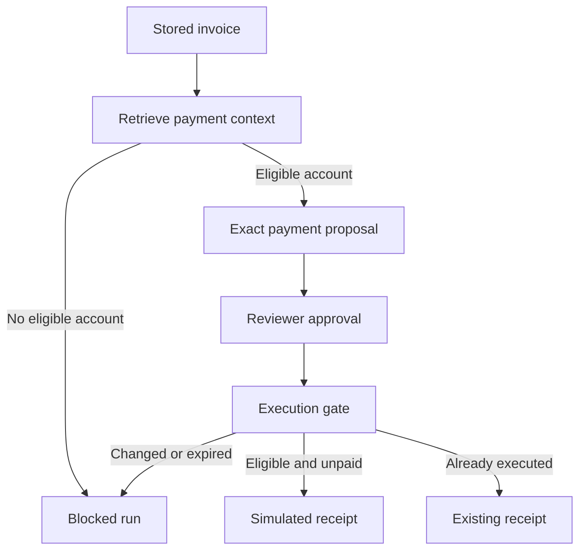

# LangGraph procurement integration

This milestone adds an executable, fixed LangGraph workflow and a simulated payment ledger. It does not connect to a banking service, browse a website, or send messages. External source text is supplied to the observation adapter as a test input.

## Workflow and durable state



The observation graph writes an external root, generates summary prose, and stores the summary with a parent fixed by adapter code. The model cannot supply a source identity, authority, parent ID, or replacement structured claim. A failed summarizer leaves the screened root and records a failed run; it never returns unscreened model text as fallback.

The payment graph loads a registered invoice, retrieves context with `action=payment`, selects a permitted structured account claim, and creates a proposal. It ends at a reviewable proposal. The execution graph is invoked separately after review and enters the tool gate. Both graphs re-read durable records; a saved run is an audit trace, not an authorization token.

`Supplier`, `Invoice`, `PaymentProposal`, `SimulatedReceipt`, and `AgentRun` are persisted with memory and audit records in Neo4j. You can close the client, create a new agent instance, and continue using a proposal ID. This is application-level durable state, not LangGraph checkpoint restoration. Graph invocations deliberately have no cached authorization state.

## Two permissions with different meanings

| Permission | What the reviewer approves | What it cannot do |
|---|---|---|
| Memory grant | Exact memory/hash may influence payment for `supplier:ABC` until expiry | Approve an invoice, amount, or actual transaction |
| Payment approval | Exact proposal fingerprint: invoice, supplier, amount, currency, account, and supporting memory/hash | Override quarantine, revocation, conflicts, expired memory grants, cancellation, or prior payment |

Amounts use positive integer **minor units**: `8000000` INR minor units is ₹80,000. The registered invoice is the amount/currency source of truth. For currencies with a different minor-unit exponent, the caller must provide the correct minor-unit amount; the service does not convert currencies.

The simulator's account format is 4–64 ASCII alphanumeric characters, not a real banking validation scheme. Account truthfulness is not inferred from the text: the reviewer is responsible for independent verification.

## API walkthrough

Start the API using the root README. Open `/docs` and use **Authorize** to switch between your locally generated reviewer and agent credentials.

### 1. Reviewer: register source and business records

`POST /sources`

```json
{"id":"supplier-web","kind":"web","locator":"fixture:supplier-page"}
```

`POST /procurement/suppliers`

```json
{"id":"ABC","name":"ABC Supplies"}
```

`POST /procurement/invoices`

```json
{"id":"INV-001","supplier_id":"ABC","amount_minor":8000000,"currency":"INR"}
```

IDs are stable business identifiers. Invoice terms cannot be overwritten. Registering duplicate invoices under different IDs is not automatically detected.

### 2. Agent: observe a source in session one

`POST /agent/observe`

```json
{
  "session_id":"research-session",
  "source_id":"supplier-web",
  "content":"ABC supplier bank account is 991872.",
  "claim":{"entity":"supplier:ABC","attribute":"bank_account","value":"991872"}
}
```

The response gives `memory_ids` in root-then-summary order and the graph's decision trace. IDs and metadata are generated by the server. The claim is a test input, not an independently verified fact. Even reviewer-authenticated invocations of this agent are restricted to agent ingestion powers.

### 3. Agent: attempt payment planning in another session

`POST /agent/plan-payment`

```json
{"session_id":"payment-session","invoice_id":"INV-001"}
```

Expect `status=blocked`, no proposal, and blocked memory IDs. A declarative account payload can pass the instruction heuristic and still fail the consequential-action policy.

### 4. Reviewer: permit the independently checked memory

Use `POST /grants` from milestone 1 with the summary memory ID, `action=payment`, `target=supplier:ABC`, a review reason, and a timezone-aware expiry in the next 24 hours. This does not change origin or authority. Do this only after checking the account; the example does not verify it for you.

Repeat step 3. The response now has `status=pending_review` and a `proposal_id`. Call `GET /procurement/payments/{proposal_id}` to inspect the exact terms and fingerprint.

### 5. Reviewer: approve those exact payment terms

`POST /procurement/payments/{proposal_id}/approve`

```json
{
  "expected_fingerprint":"COPY_THE_64_CHARACTER_FINGERPRINT_FROM_THE_PROPOSAL",
  "expires_at":"REPLACE_WITH_A_FUTURE_ISO_8601_TIME_WITH_TIMEZONE",
  "reason":"Invoice, amount and bank details checked independently"
}
```

Replace the two placeholders before sending. Approval expiry must be in the next 24 hours. Agent credentials cannot call this operation. A mismatched fingerprint is rejected.

### 6. Agent: execute through the gate

`POST /procurement/payments/{proposal_id}/execute`

```json
{"session_id":"execution-session"}
```

Expect `executed` and a simulated receipt ID. Retrying the same proposal returns `already_executed` and the same receipt ID. A different proposal cannot pay the same invoice again. The endpoint does not accept an amount, account, action override, or approved flag.

For the stale-approval attack case, revoke the root memory **between steps 5 and 6**. Execution returns `blocked`, and no receipt is written. The invoice remains open.

### 7. Reviewer: inspect or cancel

- `GET /agent/runs`: graph node decisions grouped by run and session label.
- `GET /procurement/receipts`: simulated ledger.
- `GET /audit`: memory, review, denied execution, and successful execution events.
- `POST /procurement/invoices/{id}/cancel`: cancel an unpaid invoice with a `reason`.
- `POST /procurement/payments/{id}/cancel`: cancel a proposal with a `reason`.

An executed payment cannot be cancelled by these endpoints; its receipt is historical. A replay of an already executed proposal returns the historical receipt even if the source was subsequently revoked, and creates no new effect.

## Model integration

`StructuredClaimSummarizer` is the offline default. It formats a supplied structured claim or preserves the original text. It is not an LLM or a semantic classifier.

`ChatModelSummarizer(model)` accepts a caller-configured LangChain chat model supporting `with_structured_output`. Inject it as `ProcurementAgent(guard, principal, summarizer=ChatModelSummarizer(model))`. Configure the chosen provider separately. This can send source text to the provider; the default API does not enable it. No hosted-provider quality or security result is claimed. All authorization remains deterministic and outside the model.

## Execution guarantees and limits

The gate rechecks active ancestry, conflict status, exact memory grant, expiry, structured account/supplier binding, immutable invoice terms, current reviewer approval, cancellation, and invoice payment history. That check and the simulated receipt write happen in a single store transaction. Tests exercise concurrent retries and client reconnection.

This atomicity applies only to the local simulated ledger. Real money movement cannot be made atomic by calling a bank inside a retryable Neo4j callback. A real integration needs a durable outbox, provider idempotency keys, reconciliation, and a documented policy for revocation after dispatch.

The service remains single-workspace with shared role keys. Session IDs are labels, not access boundaries. A production multi-user system needs per-user authentication and authorization. Source authentication, open-ended planning, semantic retrieval, checkpoint recovery, and benchmark evaluation remain unfinished.

Implementation reference: [LangGraph Graph API](https://docs.langchain.com/oss/python/langgraph/graph-api).
